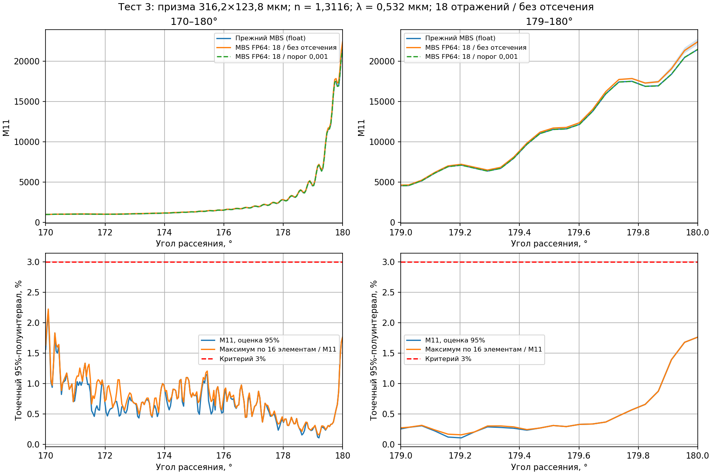
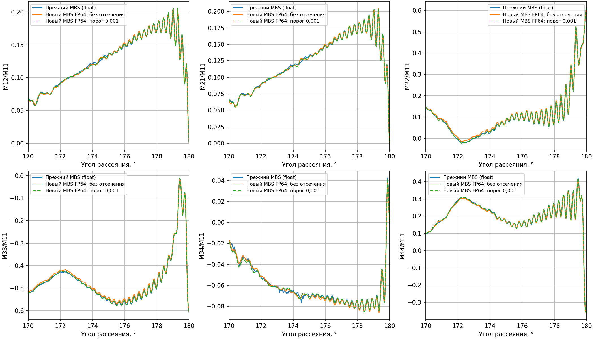

# Проверенные GPU-расчёты MBS-fast

Регулярные гексагональные призмы, λ = 0,532 мкм, n = 1,3116 + 0i.
Полное ориентационное среднее Haar; восемь независимых Owen-Sobol seeds.
Числа ниже — оценённые точечные 95%-полуинтервалы, нормированные на M11.
Критерий завершения: все 16 элементов во всех узлах ≤3% и две
последовательные проверки уточнения ≤3%, включая уточнение основной выборки.

| Тест | Высота × диаметр, мкм | Углы / узлы | Целевая глубина / cutoff | M11 | Все 16 элементов | Два изменения |
|---|---|---|---|---|---|---|
| 1 | 446,7 × 138,9 | 0–25° / 267 | 12 / off | 1,407% | 1,678% | 1,031%; 0,147% |
| 2 | 891,3 × 207,8 | 0–25° / 531 | 12 / off | 2,656% | 2,784% | 2,858%; 0,196% |
| 3 | 316,2 × 123,8 | 170–180° / 227 | 18 / off | 2,188% | 2,225% | 2,320%; 0,521% |

Параметры, размеры выборок, хэши измеренных бинарников и результаты сохранены
в [gpu_ilia_results.json](gpu_ilia_results.json). Интервалы оценивают ошибку
усреднения; они не задают физическую ошибку PO или сходимость по предельной
глубине трассировки и не являются одновременным 95%-интервалом для всей сетки.

## Тест 3: окрестность точки назад

Три GPU Tesla V100; 64 азимутальных отсчёта. Уровни:
`8/.001 → 12/.001 → 18/.001 → 18/off`.
На каждый seed использовано соответственно
`524288 / 65536 / 16384 / 2048` ориентаций.
Дорогая поправка слабых пучков оценивается отдельно на меньшей выборке;
парные полные матрицы сохраняют межуровневую ковариацию.
Аналитические контрольные компоненты отключены: подготовка таблиц известного
среднего для этой угловой области превысила установленный бюджет памяти.

Рабочий контроллер завершился за **22 мин 51 с**.
От первого пробного запуска до завершения, включая калибровку и неудачные
попытки, прошло **52 мин 17 с**. Это времена конкретного запуска на общем
сервере; ускорение относительно полного прямого расчёта не измерялось.

Исходный файл сравнения — **MBS float с cutoff 0,001**, а не ADDA.
При таком же cutoff максимальное отличие нового среднего по всем 16
элементам и всей сетке составляет 1,008% от исходного M11.
В точке 180°:

| Расчёт | M11 |
|---|---:|
| Исходный MBS float, cutoff 0,001 | 21439,46345 |
| Новый FP64, cutoff 0,001 | 21445,99346 |
| Новый FP64, cutoff off | 22390,28574 |

Отсечение 0,001 снижает M11 при 180° на 4,217% относительно значения без
отсечения. Оценка с cutoff 0,001 служит парной диагностикой; обе формальные
проверки уточнения выполнены для конечного 18/off.

Калибровка и команды запуска описаны в [README](../../README.md) и
[русском мануале](../MANUAL_RU.md). Выбор схемы уровней и окончательной глубины
пока задаётся пользователем. Встроенный `--calibrate` проверяет phi 4/8/16;
расширенный список задаётся отдельному `benchmark_gpu_optimized.py` через
`--phi-candidates`.

Матрицы всех углов доступны в CSV:
[18/off](test3_cutoff_off.csv),
[18/0,001](test3_cutoff_001.csv),
[исходный MBS float](test3_reference_float_cutoff_001.csv).
Исходная угловая сетка для `--theta-grid-file`:
[test3_theta.csv](test3_theta.csv).
